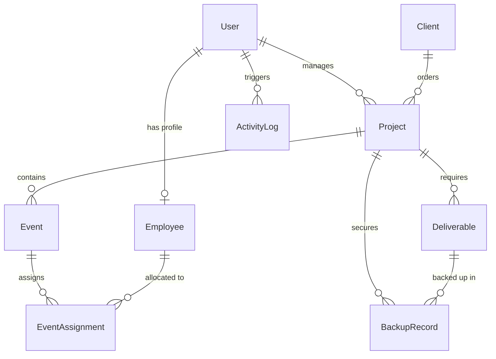

# Relational Database Model: StudioOps

StudioOps stores persistent application data in PostgreSQL. This document defines the database entities and relationships for Phase 1.

All primary keys use **UUID** types. Auditing fields (`createdAt`, `updatedAt`) are automatically populated. No media file blobs (photos, videos) are stored in the database; only text reference URLs/S3 keys are recorded.

---

## Entity Relationship Overview

---

## 1. User
* **Purpose**: Stores system authentication credentials and role permissions for internal operators.
* **Attributes**:
  * `id`: `UUID` | Required | Primary Key
  * `email`: `VARCHAR(255)` | Required | Unique
  * `passwordHash`: `VARCHAR(255)` | Required
  * `role`: `Enum(UserRole)` | Required
  * `status`: `Enum(UserStatus)` | Required
  * `createdAt`: `TIMESTAMP WITH TIME ZONE` | Required
  * `updatedAt`: `TIMESTAMP WITH TIME ZONE` | Required
* **Relationships**:
  * One-to-One with `Employee` (Optional)
  * One-to-Many with `Project` (Assigned Project Manager)
  * One-to-Many with `ActivityLog` (Author of action)
* **Enums**:
  * `UserRole`: `OWNER`, `ADMIN`, `PROJECT_MANAGER`, `EMPLOYEE`, `EDITOR`
  * `UserStatus`: `ACTIVE`, `INACTIVE`, `SUSPENDED`

---

## 2. Employee
* **Purpose**: Records employee profile details, scheduling availability, and primary professional capacities.
* **Attributes**:
  * `id`: `UUID` | Required | Primary Key
  * `userId`: `UUID` | Optional | Foreign Key -> `User(id)`
  * `fullName`: `VARCHAR(200)` | Required
  * `email`: `VARCHAR(255)` | Required | Unique
  * `phone`: `VARCHAR(50)` | Optional
  * `primaryRole`: `VARCHAR(100)` | Required (e.g. "Candid Photographer", "Lead Editor")
  * `skills`: `TEXT` | Optional (Freeform skills description tags)
  * `status`: `Enum(EmployeeStatus)` | Required
  * `createdAt`: `TIMESTAMP WITH TIME ZONE` | Required
  * `updatedAt`: `TIMESTAMP WITH TIME ZONE` | Required
* **Relationships**:
  * One-to-One with `User` (Optional)
  * One-to-Many with `EventAssignment`
* **Enums**:
  * `EmployeeStatus`: `ACTIVE`, `INACTIVE`, `ON_LEAVE`

---

## 3. Client
* **Purpose**: Represents the hiring client entity and primary contact information.
* **Attributes**:
  * `id`: `UUID` | Required | Primary Key
  * `fullName`: `VARCHAR(200)` | Required
  * `phone`: `VARCHAR(50)` | Required
  * `email`: `VARCHAR(255)` | Optional (No unique requirement)
  * `notes`: `TEXT` | Optional
  * `createdAt`: `TIMESTAMP WITH TIME ZONE` | Required
  * `updatedAt`: `TIMESTAMP WITH TIME ZONE` | Required
* **Relationships**:
  * One-to-Many with `Project`
* **Enums**: None.

---

## 4. Project
* **Purpose**: Tracks a customer contract encompassing multiple deliverables, events, and a dedicated project manager.
* **Attributes**:
  * `id`: `UUID` | Required | Primary Key
  * `clientId`: `UUID` | Required | Foreign Key -> `Client(id)`
  * `assignedProjectManagerId`: `UUID` | Optional | Foreign Key -> `User(id)`
  * `projectCode`: `VARCHAR(50)` | Required | Unique (e.g., "RSA-2026-0001")
  * `title`: `VARCHAR(255)` | Required
  * `projectType`: `VARCHAR(100)` | Required (e.g., "Wedding", "Corporate")
  * `bookingStatus`: `Enum(BookingStatus)` | Required
  * `paymentStatus`: `Enum(PaymentStatus)` | Required
  * `status`: `Enum(ProjectStatus)` | Required
  * `startDate`: `DATE` | Optional
  * `endDate`: `DATE` | Optional
  * `notes`: `TEXT` | Optional
  * `createdAt`: `TIMESTAMP WITH TIME ZONE` | Required
  * `updatedAt`: `TIMESTAMP WITH TIME ZONE` | Required
* **Relationships**:
  * Many-to-One with `Client`
  * Many-to-One with `User` (Assigned Project Manager)
  * One-to-Many with `Event`
  * One-to-Many with `Deliverable`
  * One-to-Many with `BackupRecord`
* **Enums**:
  * `ProjectStatus`: `LEAD`, `CONFIRMED`, `SCHEDULED`, `SHOOT_COMPLETED`, `POST_PRODUCTION`, `DELIVERED`, `ARCHIVED`, `CANCELLED`
  * `BookingStatus`: `INQUIRY`, `QUOTED`, `CONTRACT_SIGNED`, `DEPOSIT_PAID`, `FULLY_BOOKED`
  * `PaymentStatus`: `UNPAID`, `PARTIALLY_PAID`, `FULLY_PAID`, `REFUNDED`

---

## 5. Event
* **Purpose**: Records specific scheduling logs, locations, and timings of actions within a Project.
* **Attributes**:
  * `id`: `UUID` | Required | Primary Key
  * `projectId`: `UUID` | Required | Foreign Key -> `Project(id)`
  * `title`: `VARCHAR(255)` | Required
  * `type`: `Enum(EventType)` | Required
  * `eventDate`: `DATE` | Required
  * `startTime`: `TIME` | Required (Format: HH:MM:SS)
  * `endTime`: `TIME` | Required (Format: HH:MM:SS)
  * `venueName`: `VARCHAR(255)` | Required
  * `city`: `VARCHAR(100)` | Required
  * `address`: `VARCHAR(500)` | Required
  * `status`: `Enum(EventStatus)` | Required
  * `notes`: `TEXT` | Optional
  * `createdAt`: `TIMESTAMP WITH TIME ZONE` | Required
  * `updatedAt`: `TIMESTAMP WITH TIME ZONE` | Required
* **Relationships**:
  * Many-to-One with `Project`
  * One-to-Many with `EventAssignment`
* **Enums**:
  * `EventType`: `WEDDING`, `ENGAGEMENT`, `RECEPTION`, `HALDI`, `MEHENDI`, `SANGEET`, `BIRTHDAY`, `HOUSEWARMING`, `PRE_WEDDING`, `CORPORATE`, `OTHER`
  * `EventStatus`: `SCHEDULED`, `COMPLETED`, `CANCELLED`

---

## 6. EventAssignment
* **Purpose**: Maps employees to events. Implements time validations to detect double-booking conflict states.
* **Attributes**:
  * `id`: `UUID` | Required | Primary Key
  * `eventId`: `UUID` | Required | Foreign Key -> `Event(id)`
  * `employeeId`: `UUID` | Required | Foreign Key -> `Employee(id)`
  * `assignmentRole`: `Enum(AssignmentRole)` | Required
  * `assignmentStatus`: `Enum(AssignmentStatus)` | Required
  * `callTime`: `TIME` | Optional (Specific crew arrival time)
  * `notes`: `TEXT` | Optional
  * `createdAt`: `TIMESTAMP WITH TIME ZONE` | Required
  * `updatedAt`: `TIMESTAMP WITH TIME ZONE` | Required
* **Relationships**:
  * Many-to-One with `Event`
  * Many-to-One with `Employee`
* **Enums**:
  * `AssignmentStatus`: `PROPOSED`, `ACCEPTED`, `REJECTED`, `COMPLETED`, `CANCELLED`
  * `AssignmentRole`: `TRADITIONAL_PHOTOGRAPHER`, `TRADITIONAL_VIDEOGRAPHER`, `CANDID_PHOTOGRAPHER`, `CINEMATOGRAPHER`, `DRONE_OPERATOR`, `LIGHTING_ASSISTANT`, `ASSISTANT`, `EDITOR`, `OTHER`

---

## 7. Deliverable
* **Purpose**: Represents deliverables expected by a client, tracking review states and S3 storage reference URLs.
* **Attributes**:
  * `id`: `UUID` | Required | Primary Key
  * `projectId`: `UUID` | Required | Foreign Key -> `Project(id)`
  * `name`: `VARCHAR(255)` | Required
  * `deliverableType`: `Enum(DeliverableType)` | Required
  * `status`: `Enum(DeliverableStatus)` | Required
  * `referenceUrl`: `VARCHAR(1000)` | Optional (S3 key or external sharing link)
  * `dueDate`: `DATE` | Optional
  * `createdAt`: `TIMESTAMP WITH TIME ZONE` | Required
  * `updatedAt`: `TIMESTAMP WITH TIME ZONE` | Required
* **Relationships**:
  * Many-to-One with `Project`
  * One-to-Many with `BackupRecord` (Optional link)
* **Enums**:
  * `DeliverableStatus`: `NOT_STARTED`, `IN_PROGRESS`, `WAITING_FOR_CLIENT`, `READY_FOR_REVIEW`, `REVISION_REQUIRED`, `DELIVERED`, `COMPLETED`
  * `DeliverableType`: `PHOTOS`, `TEASER`, `FULL_VIDEO`, `ALBUM_SELECTION`, `ALBUM_DESIGN`, `HARD_DISK`, `OTHER`

---

## 8. BackupRecord
* **Purpose**: Records redundant storage location audits for a project's digital assets.
* **Attributes**:
  * `id`: `UUID` | Required | Primary Key
  * `projectId`: `UUID` | Required | Foreign Key -> `Project(id)` (Primary relationship)
  * `deliverableId`: `UUID` | Optional | Foreign Key -> `Deliverable(id)` (Optional relationship)
  * `backupType`: `Enum(BackupType)` | Required
  * `locationType`: `Enum(BackupLocationType)` | Required
  * `destinationPath`: `VARCHAR(500)` | Required (e.g. "S3://bucket/path", "Local NAS Volume 2")
  * `status`: `Enum(BackupStatus)` | Required
  * `notes`: `TEXT` | Optional
  * `verifiedAt`: `TIMESTAMP WITH TIME ZONE` | Optional
  * `createdAt`: `TIMESTAMP WITH TIME ZONE` | Required
  * `updatedAt`: `TIMESTAMP WITH TIME ZONE` | Required
* **Relationships**:
  * Many-to-One with `Project`
  * Many-to-One with `Deliverable` (Optional)
* **Enums**:
  * `BackupType`: `RAW_PHOTOS`, `RAW_VIDEOS`, `EDITED_PHOTOS`, `FINAL_VIDEO`, `ALBUM_FILES`, `FINAL_DELIVERY`, `PROJECT_ARCHIVE`
  * `BackupLocationType`: `LOCAL_NAS`, `CLOUD_S3`, `EXTERNAL_HARD_DRIVE`
  * `BackupStatus`: `PENDING`, `IN_PROGRESS`, `COMPLETED`, `FAILED`, `NEEDS_ATTENTION`

---

## 9. ActivityLog
* **Purpose**: Tracks database modifications by administrators or automated system actions.
* **Attributes**:
  * `id`: `UUID` | Required | Primary Key
  * `userId`: `UUID` | Optional | Foreign Key -> `User(id)` (Null indicates system-generated action)
  * `action`: `VARCHAR(255)` | Required
  * `details`: `TEXT` | Optional
  * `createdAt`: `TIMESTAMP WITH TIME ZONE` | Required
* **Relationships**:
  * Many-to-One with `User` (Optional)
* **Enums**: None.
