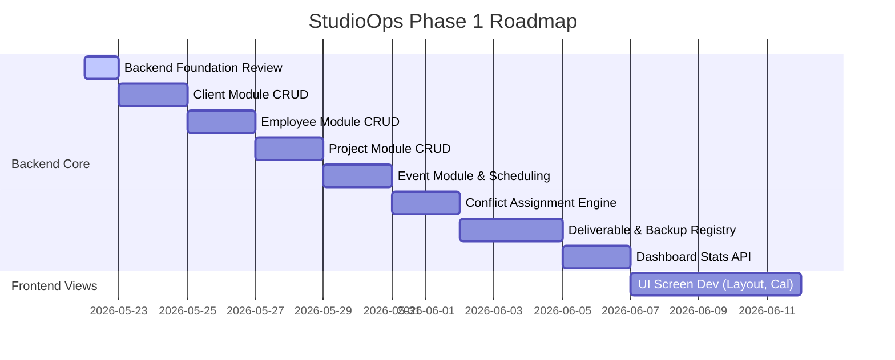

# Development Plan: StudioOps Phase 1

This document outlines the step-by-step implementation plan for StudioOps Phase 1. Development should follow the logical order below to ensure dependencies are resolved correctly.

---

## Phase 1 Implementation Plan

### Step 1: Backend Foundation Review
* **Goal**: Review the generated backend template structure, confirm Spring Boot 3.3.5 and Java 21 are fully compatible with existing project components, and ensure the dockerized PostgreSQL datasource is healthy.
* **Tasks**:
  * Verify `./mvnw clean compile` executes successfully.
  * Confirm DB migration paths (`src/main/resources/db/migration/`) are configured correctly.

### Step 2: Client Module
* **Goal**: Enable storing and editing Client contact records.
* **Tasks**:
  * Create database migration file `V2__create_client.sql`.
  * Implement `Client` JPA entity and `ClientRepository` interface.
  * Create `ClientController` with endpoints: `GET /api/clients`, `POST /api/clients`, `DELETE /api/clients/{id}`.
  * Add JUnit controller integration tests.

### Step 3: Employee Module
* **Goal**: Manage internal staff profiles and availability.
* **Tasks**:
  * Create database migration file `V3__create_employee.sql`.
  * Implement `Employee` JPA entity and `EmployeeRepository` interface.
  * Create `EmployeeController` with endpoints: `GET /api/employees`, `POST /api/employees`, `PUT /api/employees/{id}`.
  * Add unit tests to verify active/inactive states.

### Step 4: Project Module
* **Goal**: Establish project structures linked to Clients.
* **Tasks**:
  * Create database migration file `V4__create_project.sql`.
  * Implement `Project` JPA entity mapping the relational key (`clientId`).
  * Implement project status checks (`PLANNING`, `IN_PROGRESS`, `COMPLETED`).
  * Expose project REST endpoints.

### Step 5: Event Module
* **Goal**: Add event calendar schedule blocks under projects.
* **Tasks**:
  * Create database migration file `V5__create_event.sql`.
  * Implement `Event` JPA entity mapping the `projectId`.
  * Build event date overlaps check validation queries.

### Step 6: Assignment Module with Conflict Warning
* **Goal**: Assign crew to events and trigger double-booking warning indicators.
* **Tasks**:
  * Create database migration file `V6__create_event_assignment.sql` referencing `Event` and `Employee`.
  * Implement scheduling conflict resolution code.
  * *Conflict Logic*: If `startTime` of a new event overlaps with an existing event where the employee is assigned, return a response flagging `conflictWarning: true`.
  * Write unit tests ensuring overlapping schedules are correctly flagged.

### Step 7: Deliverable Module
* **Goal**: Define expected deliverables and tracking codes.
* **Tasks**:
  * Create database migration file `V7__create_deliverable.sql`.
  * Implement reference link storage (ensuring no raw files are kept in the database).
  * Enable status updates (`PENDING` -> `IN_PROGRESS` -> `READY` -> `DELIVERED`).

### Step 8: Backup Module
* **Goal**: Ensure 3-2-1 backup policies are logged and verified.
* **Tasks**:
  * Create database migration file `V8__create_backup_record.sql`.
  * Create mapping validations.
  * Implement redundancy validation: flag a warning if a deliverable has fewer than 2 distinct backup location types logged (e.g. only `LOCAL_NAS` without `CLOUD_S3`).

### Step 9: Dashboard API
* **Goal**: Aggregate system statistics, schedules, and active warning flags.
* **Tasks**:
  * Implement `/api/dashboard/summary` endpoint.
  * Query counts of active clients/projects/upcoming shoots.
  * Compile list of active double-booking conflicts and warning alerts.

### Step 10: Frontend Screens
* **Goal**: Build interactive screens in React + TypeScript.
* **Tasks**:
  * **Auth Login Screen**: Mock session skeleton.
  * **Clients Console**: Client grid list with a slide-out modal for creating/editing.
  * **Employee Calendar View**: Calendar plotting shoots, meetings, and highlighted warning colors for conflicting double-booking assignments.
  * **Project Pipeline**: Kanban/Table layout tracking projects, deliverables status, and backup redundancy badges.
  * **Dashboard Console**: Main operations hub showing stats widgets, warnings lists, and quick-action shortcuts.
