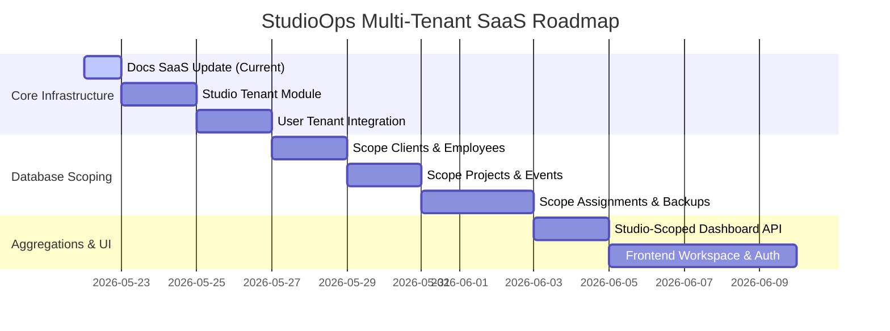

# Development Plan: StudioOps Multi-Tenant SaaS

This document outlines the step-by-step roadmap for upgrading StudioOps from a single-studio architecture to a multi-tenant SaaS platform. Development is split into logical phases to guarantee complete data isolation and clean module boundaries.

---

## Roadmap Overview

---

## Step-by-Step Implementation Roadmap

### Step 1: Documentation SaaS Update (Completed)
* **Goal**: Define product scope, database ER diagrams, API scopes, and backend guidelines for SaaS multi-tenancy.

### Step 2: Studio Module
* **Goal**: Build the tenant definition capability.
* **Tasks**:
  * Create Flyway migration file `V10__create_studios.sql` defining the `studios` table.
  * Implement `Studio` JPA entity, repository, and service.
  * Implement basic endpoints to register a studio workspace (with slug validations).

### Step 3: User Tenant Integration
* **Goal**: Update authentication to associate every user with a Studio tenant.
* **Tasks**:
  * Create Flyway migration file `V11__add_studio_id_to_users.sql` adding `studio_id` FK to the `users` table.
  * Update `User` entity to contain a relationship to `Studio`.
  * Update signup/seeding code: ensure seed users are linked to a default seed Studio workspace.
  * Update Spring Security principal retrieval to resolve `studioId` into the active authentication token.

### Step 4: Add studioId Scoping to Core Entities (Clients & Employees)
* **Goal**: Partition customer contacts and crew profiles.
* **Tasks**:
  * Create Flyway migration adding `studio_id` (not null) to the `clients` and `employees` tables.
  * Update JPA entities `Client` and `Employee` to include `studioId` mappings.
  * Refactor query parameters in repositories to filter strictly by `studioId`.
  * Update services and controllers to inject `studioId` from the authenticated security session.

### Step 5: Add studioId Scoping to Projects & Events
* **Goal**: Partition projects and events schedules.
* **Tasks**:
  * Create database migration adding `studio_id` column to `projects` and `events`.
  * Update JPA mappings, services, and repositories to support studio scoping.
  * Enforce project code uniqueness scoped *per tenant* rather than globally.

### Step 6: Add studioId Scoping to Assignments, Deliverables, and Backups
* **Goal**: Partition event crew allocations, post-production assets, and backup records.
* **Tasks**:
  * Create database migrations adding `studio_id` column to `event_assignments`, `deliverables`, and `backup_records`.
  * Refactor scheduling conflict checks to query schedules strictly under the current `studio_id`.
  * Refactor 3-2-1 backup verification metrics to run per-studio.

### Step 7: Studio-Scoped Dashboard API
* **Goal**: Limit metrics and checklists to the authenticated tenant.
* **Tasks**:
  * Update `/api/dashboard/summary` endpoint queries.
  * Retrieve counts, double-booking warnings, and backup lists scoped strictly by the current user's `studioId`.

### Step 8: Frontend Workspace & Auth
* **Goal**: Update the Vite React interface to reflect multi-tenant SaaS features.
* **Tasks**:
  * Support login configurations identifying the studio workspace (e.g. workspace subdomain routing or login matching).
  * Align the user profile panel to show the active Studio name.

---

## Technical Debt & Cleanup Notes
- **Lombok Adoption**: Adoption of Project Lombok to reduce Java boilerplate (getters, setters, builders, constructors) can be considered as a separate future cleanup task.

