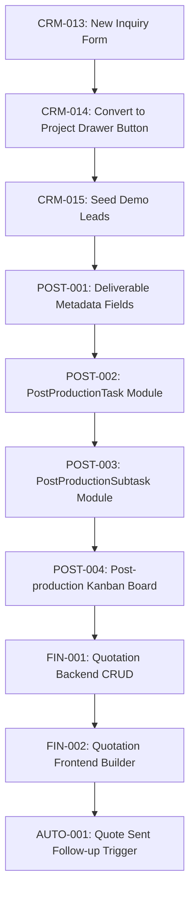

# StudioOps GitHub Issues & Milestone Planning

This document details the GitHub issue organization, milestones, completed achievements (to be created and closed), active MVP backlog (to keep open), and the future roadmap mapped directly to the **14 Core CRM/ORM Requirements**.

---

## 1. GitHub Labels Schema

To organize issues efficiently, the repository should utilize the following labels:

### A. Status Labels
* `status:completed` (Color: `#0E8A16`) — Features fully built, tested, and merged.
* `status:active` (Color: `#1D76DB`) — Currently open and planned for implementation in the active sprint.
* `status:backlog` (Color: `#D93F0B`) — Future features and enhancements kept in documentation/backlog.

### B. Type Labels
* `type:feature` (Color: `#A2EEEF`) — New functional components.
* `type:bug` (Color: `#D93F0B`) — Defect fixes and code quality regressions.
* `type:security` (Color: `#E11D21`) — Multi-tenancy isolation and authentication boundaries.
* `type:migration` (Color: `#FBCA04`) — Flyway SQL migrations.

### C. Layer Labels
* `layer:backend` (Color: `#F9D0C4`) — Spring Boot / Java.
* `layer:frontend` (Color: `#C5DEF5`) — Vite / React / TypeScript / CSS.
* `layer:database` (Color: `#BFD4F2`) — Flyway / PostgreSQL.

---

## 2. Milestones

1. **Milestone 1: MVP Foundation** — Multi-tenant core, studio scoping, authentication context, and dashboard.
2. **Milestone 2: CRM + Follow-up** — Inquiries, pipeline tracking, task queue gates, log history, and lead conversion.
3. **Milestone 3: Project Operations** — Task management, scheduling calendars, crew availability, and equipment allocation.
4. **Milestone 4: Post Production** — Editing checklists, Kanban boards, culling, deliverables progress, editor assignments.
5. **Milestone 5: Finance** — Quotation builder, discounts, invoices, expense ledgers, payments.
6. **Milestone 6: Data Storage** — S3 integration, NAS/HDD local allocations, card tracking, recovery logs.
7. **Milestone 7: Retention + Analytics** — Anniversary campaigns, review collections, profit/ROI analytics.

---

## 3. Completed Issues (Create and Close Later)

These issues represent features that are fully implemented and verified. They should be logged in GitHub and closed immediately with `status:completed`.

### Milestone 1: MVP Foundation
1. **`[SaaS-001]` Studio Tenant Module**: Create Flyway schema migration for the `studio` table, JPA entity, repository, workspace registration endpoints, and tenant validations.
2. **`[SaaS-002]` User Tenant Integration & Security Context**: Link users to studios, and configure Spring Security to resolve the tenant context scope into authentication tokens.
3. **`[SaaS-003]` Client & Crew Scoping**: Restrict client contacts and crew directories by active `studioId`.
4. **`[SaaS-004]` Project & Event Scoping**: Scope project records, calendars, and unique project codes per studio workspace.
5. **`[SaaS-005]` Scoped Dashboard API**: Enforce studio-level scoping on dashboard statistics, conflict warnings, and safety metrics.
6. **`[SaaS-006]` React Authentication Context**: Frontend login forms, routing, and tenant console workspace scoping.

### Milestone 2: CRM + Follow-up
7. **`[CRM-001]` Lead / Inquiry Database & JPA Entity**: Map Lead parameters (sources, stages, estimated values, lost reasons, timestamps).
8. **`[CRM-002]` Lead / Inquiry CRUD Backend API**: Expose endpoints for registration, search, filters, details, and updates.
9. **`[CRM-003]` Lead Stage Movement API**: Expose `/move-stage` POST endpoint with `lostReason` validation rules.
10. **`[CRM-004]` Follow-up JPA Mappings & Seeds**: Create entities/repositories for Message Templates, Sequences, Steps, Tasks, and Logs.
11. **`[CRM-005]` Follow-up Tasks Due API**: Expose `GET /api/follow-up-tasks/due` returning pending approvals.
12. **`[CRM-006]` Follow-up Tasks Gate Actions**: Expose POST `/api/follow-up-tasks/{id}/approve` and `/skip` endpoints to trigger/update status.
13. **`[CRM-007]` Communication Logs Backend API**: Expose endpoints to query dispatch history records.
14. **`[CRM-008]` Convert Lead to Project Backend Workflow**: Implement transactional lead conversion mapping to Client and Project, including phone fallbacks.
15. **`[CRM-009]` Follow-up Center Pipeline Board UI**: Build React kanban board for lead pipeline tracking.
16. **`[CRM-010]` Connect Follow-up Pipeline Stage Actions to Backend**: Connect frontend board drag-and-drop to Lead stage movement API.
17. **`[CRM-011]` Connect Follow-up Approvals Queue UI to Backend**: Hook frontend queue cards to task due/approve/skip APIs.
18. **`[CRM-012]` Connect Follow-up Communication Logs UI to Backend**: Fetch recent logs from database to render on follow-up dashboard.

---

## 4. Active Open Issues (Next 10–15 to Keep Open)

These active issues are slated for upcoming execution to refine CRM leads, establish post-production frameworks, and implement the quotation module.

### Milestone 2: CRM + Follow-up
1. **`[CRM-013]` Add frontend New Inquiry form**
   * *Description*: Build a modern React form to submit a new inquiry/lead. Hook it up to `POST /api/leads`. Include client details, event date, budget, source, and notes.
   * *Labels*: `status:active`, `type:feature`, `layer:frontend`, `module:crm-leads`
2. **`[CRM-014]` Add Convert to Project button in Lead drawer**
   * *Description*: Add a "Convert to Project" action inside the `LeadDetailDrawer`. Open a modal to let users confirm project parameters and code, calling `POST /api/leads/{id}/convert-to-project`.
   * *Labels*: `status:active`, `type:feature`, `layer:frontend`, `module:crm-leads`
3. **`[CRM-015]` Add demo seed leads for backend demo**
   * *Description*: Create a SQL migration `V26__seed_demo_leads.sql` containing diverse seed inquiries across stages (`NEW_LEAD`, `QUOTE_SENT`, `WARM`) to showcase board loading.
   * *Labels*: `status:active`, `type:feature`, `layer:database`, `module:crm-leads`

### Milestone 4: Post Production
4. **`[POST-001]` Add Deliverable priority, due date, and assigned editor**
   * *Description*: Add `priority` (enum), `due_date` (LocalDate), and `assigned_editor_id` (UUID) to `Deliverable` entity and database schema. Update CRUD, DTOs, and mapper configurations.
   * *Labels*: `status:active`, `type:feature`, `layer:backend`, `layer:database`, `module:post-prod`
5. **`[POST-002]` Add PostProductionTask backend module**
   * *Description*: Create the database schema and JPA module for `PostProductionTask` representing editing/culling stages of deliverables. Include status tracking.
   * *Labels*: `status:active`, `type:feature`, `layer:backend`, `layer:database`, `module:post-prod`
6. **`[POST-003]` Add PostProductionSubtask backend module**
   * *Description*: Create entity, repository, and controller for checking subtasks (e.g. "Create highlights draft", "Export raw edits") linked to production tasks.
   * *Labels*: `status:active`, `type:feature`, `layer:backend`, `module:post-prod`
7. **`[POST-004]` Add Post-production Kanban board frontend**
   * *Description*: Implement a React board panel to track production tasks across states (To Do, In Progress, Review, Completed) filtered by editors.
   * *Labels*: `status:active`, `type:feature`, `layer:frontend`, `module:post-prod`

### Milestone 5: Finance
8. **`[FIN-001]` Add Quotation backend module**
   * *Description*: Build `Quotation` entity, DB tables, and REST endpoints for creating quotes linked to Leads, capturing item lists, taxes, and final pricing.
   * *Labels*: `status:active`, `type:feature`, `layer:backend`, `layer:database`, `module:finance`
9. **`[FIN-002]` Add Quotation frontend builder**
   * *Description*: Create interactive quote generator form in React to add packages, input items, apply discounts, and calculate totals.
   * *Labels*: `status:active`, `type:feature`, `layer:frontend`, `module:finance`

### Milestone 2: CRM + Follow-up (Automation Engine)
10. **`[AUTO-001]` Generate FollowUpTasks when quotation is marked sent**
    * *Description*: Wire up Quotation updates. Transitioning a lead's quotation status to "Sent" will invoke the Sequence Scheduler to generate draft `FollowUpTask` approval items.
    * *Labels*: `status:active`, `type:feature`, `layer:backend`, `module:followup`

---

## 5. Future Roadmap List (Client CRM/ORM Requirements)

These features remain in the backlog and are grouped under the client's core operational areas. They are **not** created as active issues yet to keep GitHub clean.

### Area 1: Lead Management
* **New Inquiry frontend form**: Easy manual lead logging form (Covered in Active: `[CRM-013]`).
* **Convert to Project button**: Quick transition from lead details (Covered in Active: `[CRM-014]`).
* **Seed leads**: Test data setups (Covered in Active: `[CRM-015]`).

### Area 2: Quotation, Negotiation & Deal Closure
* **Quotation module**: Backend CRUD for quote versions (Covered in Active: `[FIN-001]`).
* **Quotation builder UI**: Pricing calculation form (Covered in Active: `[FIN-002]`).
* **Package builder**: Predefined price list items catalog.
* **Quote PDF/export**: Generate downloadable PDF document of quotation details.
* **Discount approval**: Operational workflows requiring owner signoff on custom discount entries.
* **Contract signing**: Digital document sign-off and electronic signature fields.

### Area 3: Project Planning & Team Assignment
* **Project checklists**: Shoot checklists and logistics detail cards.
* **Freelancer scheduling availability**: Dynamic calendars for external sub-contractors.

### Area 4: Production Department
* **Equipment inventory**: Camera body, lens, and lighting catalog.
* **Equipment tracking**: Allocation schedules of specific gear to field events.

### Area 5: Finance, Payments & Accounts
* **Payment milestones**: Scheduled payment deadlines (booking deposit, mid-payment, final delivery balance).
* **Invoice management**: Automatic invoice rendering and receipt dispatch.
* **Freelancer payments tracker**: Log agreed contractor fees and payments.

### Area 6: Credit & Debit Management
* **Expense ledger**: Track recurring studio bills, marketing spend, and travel allowances.

### Area 7: Employee Management
* **Employee attendance/work hours**: Log check-ins and shoot hours.
* **Leave management**: Annual leave trackers and crew block-out dates.

### Area 8: Data Maintenance & Storage
* **Memory card tracking**: Log memory cards used, backup verification states, and formatting logs.
* **Hard disk allocation**: Track customer file folders mapped to specific physical archive drives.
* **Archive/data recovery logs**: Audit trail of file recovery requests and drive safety status.

### Area 9: Post Production Workflow
* **Deliverable priority & Editor assignments**: Set timelines, urgency, and staff (Covered in Active: `[POST-001]`).
* **Post-production task module**: Task-level editing records (Covered in Active: `[POST-002]`).
* **Post-production subtask module**: Granular checklists per editor (Covered in Active: `[POST-003]`).
* **Post-production Kanban board**: Visual editor project lanes (Covered in Active: `[POST-004]`).
* **Photo culling workflow**: Select/cull photo numbers and flag highlight albums.
* **Revision workflow**: Track customer edit requests, revisions comments, and file re-exports.
* **QC approval**: Studio admin sign-off on highlights before dispatching client email.

### Area 10: Album Design & Delivery
* **Album selection/design/review/approval**: Multi-step album flow. Customers select photos, editors submit designs, and pages are approved page-by-page.
* **Printing vendor coordination**: Track printing status and dispatch to physical print houses.
* **Packaging/dispatch tracking**: Shipping courier references and package delivery details.

### Area 11: Account Closure
* **Project closure checklist**: Ensure raw files backed up, final payments made, deliverables approved, and cards formatted.

### Area 12: Client Retention Program
* **Festival/anniversary greetings**: Automatic client notifications for anniversaries and festivals.
* **Referral tracking**: Trace lead source references back to past clients for reward systems.
* **Review collection**: Automated campaign triggers asking clients to leave a Google business review.

### Area 13: Admin & Operations
* **Activity Logs**: Global history logging of core entity adjustments.

### Area 14: Analytics & Reporting
* **Lead conversion reports**: Insights on leads booking percentages by month.
* **Revenue reports**: Realized payments, cashflows, and unpaid balances.
* **Team performance reports**: Project completion times and workload per editor.
* **Project profitability dashboard**: Margin calculations balancing client price minus photographer fees, travel, editing, printing costs.
* **Marketing ROI tracking**: Track leads count and conversion rates filtered by marketing channels.

---

## 6. Recommended Next 10 Implementation Order

The recommended sequence prioritizes finishing the lead funnel frontend, setting up the post-production task module, and building quotation engines:

1. **`[CRM-013]` Add frontend New Inquiry form**: Enables manual lead creation in the Follow-up Center.
2. **`[CRM-014]` Add Convert to Project button in Lead drawer**: Bridges Lead management directly to Project management.
3. **`[CRM-015]` Add demo seed leads**: Populates stages to enable full pipeline and conversion UI tests.
4. **`[POST-001]` Add Deliverable priority, due date, and assigned editor**: Adds scheduling constraints to delivery workflows.
5. **`[POST-002]` Add PostProductionTask backend module**: Builds core database entities for post-production editing stages.
6. **`[POST-003]` Add PostProductionSubtask backend module**: Establishes granular editing checklist capacity.
7. **`[POST-004]` Add Post-production Kanban board frontend**: Creates visual workspace for editor assignments and deliverables progress.
8. **`[FIN-001]` Add Quotation backend module**: Sets up database framework for client proposals.
9. **`[FIN-002]` Add Quotation frontend builder**: Provides the pricing calculator interface.
10. **`[AUTO-001]` Generate FollowUpTasks when quotation is marked sent**: Integrates finance stages with follow-up automation.
