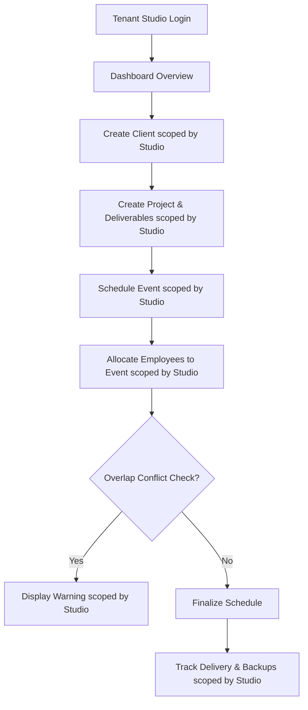

# Product Specification: StudioOps

## 1. Product Overview
**StudioOps** is a multi-tenant Software-as-a-Service (SaaS) subscription platform built specifically for photography and creative studios (such as photography, cinematography, and design agencies) to manage their operations. The platform enables multiple independent photography companies (studios) to manage their CRM (clients), projects, event calendars, team allocation, crew availability planning, post-production workflows, delivery, backup tracking, and future client lifetime access.

By unifying client management, scheduling, and asset safety records in a single interface, StudioOps reduces coordination overhead, prevents double-booking mistakes for studio crews on location, and enforces strict tenant data isolation.

---

## 2. SaaS Tenant & User Architecture

### A. Studio (Tenant)
Each creative studio operates in its own isolated workspace (tenant). 
* **Subscription Management**: Studios subscribe to plans to unlock operational limits.
* **Workspace Settings**: Independent timezones, branding, and contact details.

### B. User Roles
Within each Studio workspace, users are defined and assigned role permissions:
* **OWNER**: Full system read and write privileges, including subscription billing configuration.
* **ADMIN**: Full operational access (CRUD client, project, event, employee, deliverables).
* **PROJECT_MANAGER**: Manages specific customer projects, schedules, and deliverables.
* **PHOTOGRAPHER**: Field crew. Read-only calendar and assignment details.
* **VIDEOGRAPHER**: Field crew. Read-only calendar and assignment details.
* **EDITOR**: Post-production specialist. Can update deliverable progress, references, and logs.
* **FREELANCER**: Contractors. Restricted view of specific events they are assigned to.
* **CLIENT**: Customer profiles. Direct portal access (online galleries, contract signoffs) is planned for later phases.

---

## 3. Subscription & Billing Plans
StudioOps operates on a tiered monthly/annual SaaS subscription model:

| Plan | Target Audience | Key Features Included |
| :--- | :--- | :--- |
| **STARTER** | Solo creators / Small teams | Basic CRM, up to 3 active projects, single crew scheduling. |
| **STUDIO** | Standard mid-size studios | Unlimited projects, crew availability planning, backup tracking. |
| **PRO** | Large multi-city agencies | Advanced scheduling engine, double-booking warnings, full deliverables dashboard. |
| **ENTERPRISE** | Custom high-volume studios | Custom integrations, dedicated support, custom data retention rules. |

> [!NOTE]
> **Billing Integration**: Real-time billing transactions, plan upgrades, and invoice generation are planned for future phases. Future billing provider options include Stripe, Paddle, and Razorpay.

---

## 4. Main Multi-Tenant Workflows

### Workflow 1: Client & Project Setup
1. Authenticated user registers a new Client under their Studio.
2. User creates a Project linked to that Client, scoped strictly to their `studioId`.
3. User defines the Deliverables list for the project (e.g., "Wedding Raw Footage", "Edited Highlight Video").

### Workflow 2: Event Scheduling & Allocation
1. User adds an Event under a Project specifying date, start time, end time, venue, and location details.
2. User allocates Employees (registered under the same Studio) to the Event.
3. The system checks the schedule. If any assigned employee is allocated to another overlapping event within the same Studio, the system registers a conflict warning.

### Workflow 3: Assets & Backup Management
1. After shoot completion, the editor uploads files to cloud storage (external storage).
2. Editor/User logs the Backup execution (e.g., "Backup to NAS local", "Cloud AWS backup") and marks the Deliverable as "Delivered" once sent to the client.

---

## 5. Out of Scope (Phase 1 MVP)
To ensure a clean, focused initial delivery, the following features are **explicitly excluded**:
* **Client Portal**: Clients cannot log in to view galleries or contract states.
* **Online Gallery Upload**: Direct file/media uploads to the platform database.
* **Payment Gateway Integration**: Direct subscription Stripe/Paddle billing checkouts or customer invoicing.
* **WhatsApp / SMS Automation**: External message integrations and event reminders.
* **Mobile Application**: Native iOS/Android app wrappers.
* **Advanced Analytics**: Multi-tenant platform financial margin analysis, global platform administration dashboards.

---

## 6. Acceptance Criteria

### Security & Access Control
* Users must be authenticated to view any workspace resource.
* Unauthenticated access requests must redirect to the login screen.
* **Strict Tenant Isolation**: A user belonging to Studio A must never read, write, or check availability/conflicts of any entity associated with Studio B.

### Client & Project Management
* Users can successfully Manage (CRUD) client records scoped to their `studioId`.
* Projects must link to a valid Client and have a defined status (e.g., `PLANNING`, `IN_PROGRESS`, `COMPLETED`), scoped to the same `studioId`.

### Event Scheduling & Warnings
* Events must specify absolute timestamps and venue details, scoped to the current `studioId`.
* Overlapping event assignment check is executed strictly against assignments under the same `studioId`.

### Deliverables & Backups
* Deliverables must map to a Project and track delivery states (`PENDING`, `IN_PROGRESS`, `DELIVERED`).
* Each deliverable must track backup targets. A deliverable is marked as "Fully Backed Up" only if at least two distinct backup locations (e.g., Local NAS and Cloud) are logged as successfully completed, scoped to the `studioId`.

### System Dashboard
* Displays total clients count, active projects pipeline, upcoming event calendars (next 7 days), filtered by the active user's `studioId`.
* Summarizes active double-booking conflicts and incomplete backup tasks for the current Studio.
