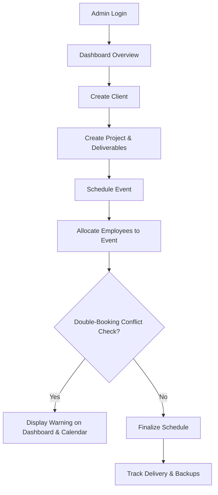

# Product Specification: StudioOps

## 1. Product Overview
**StudioOps** is an operations management and scheduling platform built specifically for creative studios (such as photography, cinematography, and design agencies). The platform streamlines the backend lifecycle of client bookings, project tracking, event calendars, employee allocations, deliverable status tracking, and critical media backup records. 

By unifying client management, scheduling, and asset safety records in a single interface, StudioOps reduces coordination overhead and prevents double-booking mistakes for studio crews on location.

---

## 2. Phase 1 Goals (MVP)
The goal of Phase 1 is to deploy a secure, internal-only management tool that covers:
1. **Core Admin Console**: A secure dashboard workspace for Studio Owners and Administrators.
2. **Operations Dashboard**: Centralized view summarizing recent client actions, project pipelines, upcoming events, and system warning logs.
3. **Preventive Team Scheduler**: An allocation engine that assigns staff to events and warns if an employee has overlapping event assignments (double-booking warning).
4. **Operations Tracker**: Basic CRUD utilities for managing Clients, Projects, Events, Staff, and Deliverables.
5. **Asset Registry**: Tracking media delivery status and multi-tier backup completion status.

---

## 3. User Roles

### A. Studio Owner / Administrator (Admin)
* **Access**: Full system read and write privileges.
* **Key capabilities**:
  * Manage clients, project records, events, and staff metadata.
  * Assign employees to events.
  * Track deliverable states and verify backup completion logs.
  * Access the core control dashboard containing warning signals.

### B. Employee (Staff)
* **Access**: Internal credentials; read-only access to schedules and assigned projects/events.
* **Key capabilities**:
  * View personal booking calendar.
  * Check venue details and project timing.

### C. Client (System Representation Only)
* **Access**: No portal login access in Phase 1.
* **Key capabilities**: represented as data entities inside the database to associate with projects, billing details, and event logistics.

---

## 4. Main Workflows

### Workflow 1: Client & Project Setup
1. Admin registers a new Client.
2. Admin creates a Project linked to that Client (e.g., "Smith Wedding 2026", "Corporate Gala Promo").
3. Admin defines the Deliverables list for the project (e.g., "Wedding Raw Footage", "Edited Highlight Video").

### Workflow 2: Event Scheduling & Allocation
1. Admin adds an Event under a Project specifying date, start time, end time, and location.
2. Admin allocates Employees to the Event.
3. The system checks the schedule. If any assigned employee is already allocated to another event overlapping with this window, the system registers a conflict warning.

### Workflow 3: Assets & Backup Management
1. After shoot completion, the editor uploads files to cloud storage (external storage, out-of-scope for DB storage).
2. Editor/Admin logs the Backup execution (e.g., "Backup to NAS local", "Cloud AWS backup") and marks the Deliverable as "Delivered" once sent to the client.

---

## 5. Out of Scope (Phase 1)
To ensure a clean, focused initial delivery, the following features are **explicitly excluded**:
* **Client Portal**: Clients cannot log in to view galleries or contract states.
* **Online Gallery Upload**: Direct file/media uploads to the platform database.
* **Payment Gateway**: Payment processing, stripe invoicing, and automatic transactions.
* **WhatsApp / SMS Automation**: External message integrations and event reminders.
* **Mobile Application**: Native iOS/Android app wrappers.
* **Advanced Analytics**: Financial margin analysis, payroll calculators.
* **AI Features**: Smart resource auto-allocation, automated tagging.

---

## 6. Acceptance Criteria

### Security & Access Control
* Users must be authenticated to view any screen (excluding health endpoint).
* Unauthenticated access requests must redirect to the login screen.

### Client & Project Management
* Admin can successfully Create, Read, Update, and Delete client records.
* Projects must link to a valid Client and have a defined status (e.g., `PLANNING`, `IN_PROGRESS`, `COMPLETED`).

### Event Scheduling & Warnings
* Events must specify absolute timestamps (Date, Start Time, End Time) and venue.
* If an employee is assigned to multiple events on the same day with overlapping time windows, a clear warning badge must appear on the event assignment panel and the dashboard.

### Deliverables & Backups
* Deliverables must map to a Project and track delivery states (`PENDING`, `IN_PROGRESS`, `DELIVERED`).
* Each deliverable must track backup targets. A deliverable is marked as "Fully Backed Up" only if at least two distinct backup locations (e.g., Local NAS and Cloud) are logged as successfully completed.

### System Dashboard
* Displays total clients count, active projects pipeline, upcoming event calendars (next 7 days).
* Summarizes active double-booking conflicts and incomplete backup tasks.
